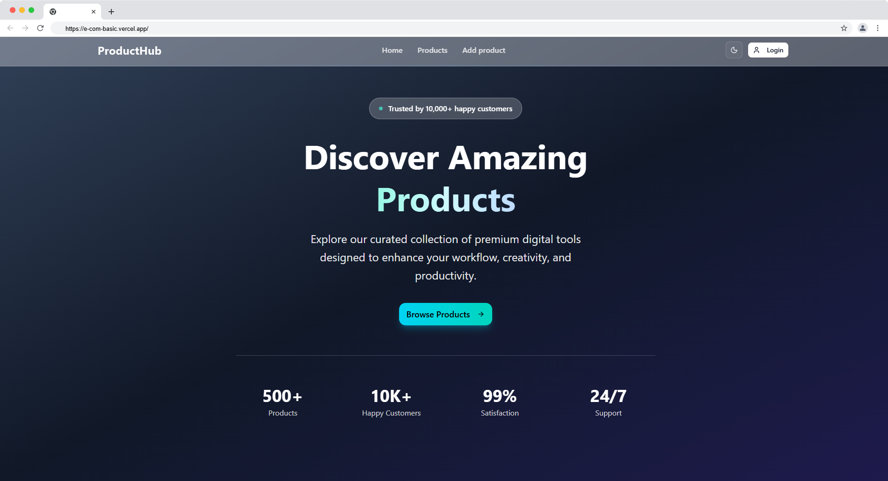

# 🛒 E-com Basic

[](https://e-com-basic.vercel.app)


---

## ✨ Project Overview

**E-com Basic** is a modern e-commerce demo built with Next.js, React, and TypeScript. It features a clean UI, fast performance, and accessibility-first components. Explore products, view details, and manage your store with a beautiful dashboard.

---

## 🚀 Live Demo

🔗 [e-com-basic.vercel.app](https://e-com-basic.vercel.app)



---

## ⚡️ Features

- **Next.js 15.5** — App router, API routes, Turbopack
- **React 19.1** — Latest hooks & features
- **TypeScript 5** — Type-safe codebase
- **TailwindCSS 4** — Utility-first styling
- **Radix UI & Lucide Icons** — Accessible, customizable UI
- **NextAuth** — Authentication
- **ESLint** — Code quality

---

## 🛠️ Setup & Installation

1. **Clone the repo:**

   ```sh
   git clone https://github.com/yourusername/e-com-basic.git
   cd e-com-basic
   ```

2. **Install dependencies:**

   ```sh
   pnpm install
   # or
   yarn install
   ```

3. **Run the development server:**

   ```sh
   pnpm run dev
   # or
   yarn dev
   ```

4. **Build for production:**
   ```sh
   pnpm run build
   pnpm run start
   ```

---

## 🗺️ Route Summary

| Route                          | Description             |
| ------------------------------ | ----------------------- |
| `/`                            | Home page               |
| `/products`                    | All products listing    |
| `/products/[id]`               | Product detail page     |
| `/auth/login`                  | Login page              |
| `/admin/dashboard`             | Admin dashboard         |
| `/admin/dashboard/add-product` | Add new product (admin) |
| `/api/products`                | Products API endpoint   |
| `/api/auth/[...nextauth]`      | Auth API endpoint       |
| `/api/health`                  | Health check endpoint   |
| `/api/products/featured`       | Featured products API   |

---

## 📦 Tech Stack

- **Next.js**
- **React**
- **TypeScript**
- **TailwindCSS**
- **Radix UI**
- **Lucide React**
- **NextAuth**
- **Mongoose**
- **ESLint**

---
